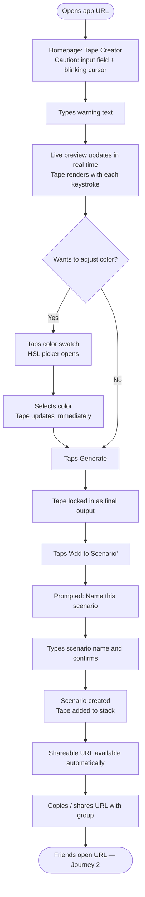
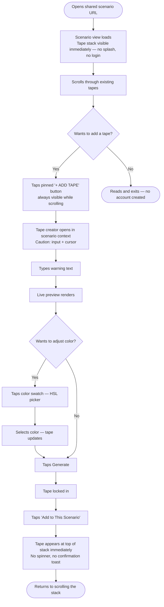
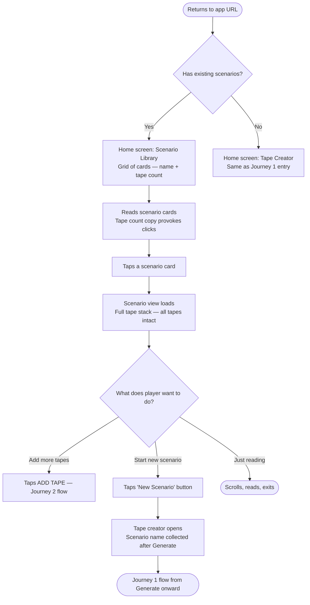

# UX Design Specification — Caution Tape Generator

**Author:** Melissa
**Date:** 2026-03-29

---

## Executive Summary

### Project Vision

A personal, social web tool for creating and sharing absurdist fake caution tape warnings with friends. The entire product rests on a single joke executed with total commitment — the more seriously the tape looks, the funnier the absurd content becomes. The format never winks at the viewer. That seriousness is the punchline.

The core design philosophy: **seriousness of format + absurdity of content = the whole experience.** Every design decision must ask: "does this make the commitment to the bit stronger?" The product never breaks character.

### Target Users

**The Instigator** — pulls out the app mid-social moment (dinner, drinks, hanging out), creates a scenario, shares the link with the group in the room. Tech-comfortable, socially playful, demands zero friction in the moment. If the app fumbles during the reveal, the moment is gone.

**The Contributor** — receives a shared link cold with zero context. Lands directly inside an existing scenario, sees the tapes, adds one without ever needing to understand the app first. The entire experience must be self-evident on arrival.

**The Returning Player** — comes back days later to a scenario they were part of, picks up where they left off, possibly starts a new one for a different group. Needs everything to be exactly where they left it with no login ceremony.

### Key Design Challenges

1. **The two-entry-point problem** — The homepage (Creator flow) and the shared-link experience (Contributor flow) are completely different entry points. The UX must feel coherent and equally frictionless despite never starting the same way twice.
2. **Mobile-first, in-the-moment performance** — This app gets used with people watching. Any hesitation, confusion, or load lag kills the social moment. The UI must be instantly readable and operable under real social pressure.
3. **The tape visual is the product** — The entire UX is in service of one visual output. If the tape doesn't look genuinely official, the joke falls flat. The live preview experience is the highest-risk design challenge and must be nailed before anything else.

### Design Opportunities

1. **The dead-simple homepage as brand statement** — Just "CAUTION:" and a blinking cursor. That emptiness is the invitation. Executed well, it's the funniest and most confident first impression a web app can make.
2. **Scenario status as free gamification** — Auto-generated labels ("Under Investigation" → "Active Incident" → "Total Containment Failure") based on tape count cost nothing to build but create a social loop compelling enough to keep adding tapes.
3. **The tape count as provocation** — "23 tapes about a Taco Bell??" on a scenario card is more compelling than any call-to-action. Information design and copy can carry significant UX weight throughout the product.

## Core User Experience

### Defining Experience

The ONE thing users do most frequently: **type a warning and watch the tape render live.** That's the heartbeat of the entire product. Every other interaction is scaffolding around that moment.

The critical action to get absolutely right: **the live preview.** The tape must appear instantly as characters are typed — no submit button between thought and visual. The moment of "oh that looks real" IS the product experience. If that's laggy, delayed, or visually unconvincing, nothing else matters.

### Platform Strategy

- **Web app, mobile-first** — primary use case is phones passed around a table in real time
- **Touch-first** — tap targets sized for in-the-moment use; no fiddly interactions; color picker optimized for touch
- **No offline requirement** — social use case assumes connectivity; persistence via server, not local storage
- **No native capabilities needed** — web standards are sufficient; the one exception is image export (save/share tape), which may leverage native share sheet on mobile
- **Cross-browser** — Mobile Safari and Chrome for Android are required; desktop Chrome as secondary

### Effortless Interactions

These must require zero thought from the user:

- **Typing → seeing the tape** — should feel like the tape is being pulled directly from the keyboard. No delay, no button.
- **Opening a shared link → being inside the game** — no splash screen, no "sign up to view", no explanation. You land and you're already playing.
- **Adding a tape from within a scenario** — the ADD button is always visible, always pinned. One tap and you're in creation mode.
- **Sharing a scenario** — the link already exists before they think to share it. No "generate link" button to click.

### Critical Success Moments

| Moment | Why it's make-or-break |
|---|---|
| **First tape render** | If it doesn't look genuinely official, the joke doesn't land and there's no reason to continue |
| **The friend opens the link** | If they land anywhere other than directly inside the scenario, the social handoff is broken |
| **The tape count on a scenario card** | If the copy doesn't provoke ("23 tapes? I have to see this"), the library screen feels like a file manager, not a game |
| **After a tape is added** | The tape must appear immediately in the stack — delay here breaks the group moment |

### Experience Principles

1. **Never break the bit** — Every interface element should reinforce the industrial seriousness. No playful UI chrome, no winking copy, no "fun" loading spinners. The interface takes itself completely seriously.
2. **The link is the onboarding** — There is no onboarding. Landing in a scenario IS the tutorial. The experience must be completely self-evident without a single word of instruction.
3. **Speed is the social lubricant** — Every interaction that happens in front of other people must be instant. Lag is embarrassment. Performance is a UX requirement, not a technical nicety.
4. **Friction is the enemy** — Count the steps between "I want to add a tape" and "the tape is in the scenario." The answer should always be approaching one.

## Desired Emotional Response

### Primary Emotional Goals

The Caution Tape Generator is built around a single emotional peak: **the delight of recognition** — that immediate jolt of "oh that looks REAL" the moment the tape renders. Everything in the product exists to deliver, sustain, and share that moment.

**Primary feeling:** Gleeful complicity. Users aren't just entertained — they're in on the joke together. The product makes everyone at the table feel like they're co-authors of something absurd and real-looking at the same time.

**The feeling that makes users tell a friend:** "You have to see this" — specifically triggered by seeing a tape that looks genuinely official paired with something completely unhinged. The format/content contrast is the viral unit.

### Emotional Journey Mapping

| Stage | Desired Feeling |
|---|---|
| **First arrival (homepage)** | Instant recognition — "I know exactly what to do here" without reading a word |
| **Typing the first warning** | Anticipation building with each keystroke as the tape renders live |
| **First tape render** | Surprise and delight — "it actually looks real" |
| **Naming and creating the scenario** | Creative ownership — "this is mine, I started this" |
| **Sharing the link** | Excitement — passing the game to others |
| **Friends add tapes** | Social warmth + competitive absurdity — "mine was funnier" |
| **Returning days later** | Nostalgia + surprise — rediscovering the jokes, instantly wanting to add more |
| **Something fails (slow load, save error)** | Mild confusion, not panic — nothing should feel fragile or broken |

### Micro-Emotions

| Emotion | Role in the experience |
|---|---|
| **Confidence** | Critical — users must never feel lost or uncertain about what to do next |
| **Surprise** | The live preview delivers this on every first use; tape quality exceeds expectations |
| **Belonging** | The shared scenario creates a small, anonymous group with a shared joke |
| **Accomplishment** | Adding a tape that makes the group laugh — the social validation is the payoff |
| **Delight** | The tape count provocations, scenario status labels, reaction set — layered throughout |
| **Trust** | Users need to trust their tapes won't disappear — persistence is an emotional promise |

**Emotions to avoid:** Confusion (the experience must always be self-evident), embarrassment (fumbling the app in front of others), anxiety (nothing should feel breakable or loseable).

### Design Implications

- **Confidence → zero instruction** — The UI must communicate its purpose through shape and layout alone. If a user reads a tooltip, we've already failed.
- **Surprise/Delight → live preview fidelity** — The tape must render beautifully from the first character. The reveal isn't a button click — it happens continuously as they type.
- **Belonging → anonymous but persistent** — No names, no handles, but the tapes stay. The scenario is the group's shared object, not any one person's.
- **Trust → instant save feedback** — When a tape is added, it appears in the stack immediately. No spinner. No "saved!" toast. It's just there. That's the confirmation.
- **Avoid embarrassment → performance is non-negotiable** — A slow moment in front of friends is the worst possible UX outcome. Speed is an emotional design requirement.

### Emotional Design Principles

1. **Delight lives in the gap** — The comedy and the emotional payoff come from the contrast between serious format and absurd content. Design must protect and widen that gap, never collapse it.
2. **Confidence through clarity** — Every screen has one obvious thing to do. The emptiness of the homepage is intentional — constraint creates confidence, not confusion.
3. **Social warmth through persistence** — The emotional promise of the product is "your jokes are safe here." Reliability and persistence are emotional requirements, not just technical ones.
4. **Never interrupt the moment** — Any friction, lag, or unexpected step during a group interaction is a social failure. The design must be invisible when people are watching.

## UX Pattern Analysis & Inspiration

### Inspiring Products Analysis

**Wordle** — The gold standard of "you understand it in 3 seconds." One input, one action, one result per session. The constraint IS the design. No menu, no settings sprawl, no tutorial. Wordle's lesson: empty space is not wasted space — it's invitation.

**Jackbox Games** — Nailed the "shared link = instant game entry" mechanic better than almost anyone. You join a room code and you're playing. No account, no friction, no explanation needed. The phone IS the controller. Critically: it works in a group setting where people are watching each other's screens.

**Simple generator sites (name generators, excuse generators, etc.)** — The best ones have a single input, a single output, and nothing else on the page. Their weakness: the output rarely looks good enough to share. This is where the Caution Tape Generator has a genuine edge — the tape visual is a real artifact.

**DALL-E / image generation tools** — Taught users that typing something and seeing a visual result instantly is magical. The live feedback loop between input and output is now an established UX pattern users understand intuitively.

### Transferable UX Patterns

**Navigation Patterns:**
- **No navigation** — Wordle has no nav bar. The homepage should follow suit. The only secondary element is the scenario library link — everything else is the tape creator.
- **Deep link as entry point** — Jackbox's room code = our shareable URL. The link IS the navigation for Contributors.

**Interaction Patterns:**
- **Input → live output loop** — DALL-E popularized the "your text becomes a visual" expectation. We adopt this wholesale: no submit button on the live preview.
- **Single primary action per screen** — Every screen has exactly one thing to do. One field, one preview, one confirm.
- **Pinned persistent action** — The pinned ADD button in the scenario view follows the proven floating action button pattern from mobile-first apps.

**Visual Patterns:**
- **High contrast, maximum legibility** — Generator tools that look serious use bold type on high-contrast backgrounds. The tape's industrial typography follows this to commit to the bit.
- **Card grids for collections** — Proven pattern for collection views. The scenario library adapts this with name + provocative tape count as the card content.

### Anti-Patterns to Avoid

- **Onboarding flows** — Any splash screen, tooltip overlay, or "here's how it works" modal breaks the Jackbox principle. You land and you're playing.
- **Account prompts at any step** — Sign up walls, even optional ones, kill anonymous social products.
- **Multiple CTAs competing** — One screen, one job. Generator sites that scatter attention lose the bit.
- **Playful/whimsical UI chrome** — Confetti, bouncing elements, cartoon illustrations wink at the user and collapse the industrial seriousness that makes the joke work.
- **Confirmation dialogs** — "Are you sure you want to add this tape?" destroys momentum. Trust the user.

### Design Inspiration Strategy

**Adopt:**
- Wordle's "one thing, obviously" homepage philosophy
- Jackbox's deep-link-as-onboarding mechanic
- The live input → visual output loop from image generation tools

**Adapt:**
- Card grid collection views → scenario library with provocative copy instead of generic metadata
- Floating action button → pinned ADD button styled to match the industrial aesthetic

**Avoid:**
- Any pattern that adds ceremony (accounts, onboarding, confirmation steps)
- Any visual style that signals "fun web toy" rather than "official warning system"

## Design System Foundation

### Design System Choice

**Tailwind CSS** — utility-first CSS framework, no pre-built component library. All UI components composed from primitives using custom design tokens.

### Rationale for Selection

- The product's industrial aesthetic is intentionally anti-"friendly-app" — established component libraries (MUI, Chakra) carry visual language that would undermine the bit and require heavy overriding
- UI complexity is low — roughly 5 distinct patterns across the entire product — making a full component library unnecessary infrastructure
- The tape rendering is fully custom regardless, so the design system only governs the minimal shell UI
- Tailwind's utility-first approach enables fast iteration for a solo developer, and its mobile-first defaults align with the primary use platform
- Hard edges, tight spacing, bold typography, and high contrast are natural to express in Tailwind without fighting defaults

### Implementation Approach

- Define a custom Tailwind config with a project-specific color palette (industrial yellows/blacks/whites), typography scale (one display font, one mono/industrial body font), and spacing tokens
- Compose all UI patterns (tape creator, scenario card, scenario view, ADD button) directly from Tailwind utilities — no component library dependency
- Use CSS custom properties alongside Tailwind for the tape-specific visual variables (stripe colors, tape dimensions) that live outside the normal UI layer

### Customization Strategy

- **Color tokens:** A strict palette — caution yellow, near-black, white, and a small set of tape color overrides for the picker
- **Typography:** One industrial/bold display face for tape text and headers; system-safe monospace or condensed sans for UI chrome
- **Spacing:** Generous padding on tap targets (mobile-first), tight information density on the scenario library
- **No border-radius on structural elements** — hard corners reinforce the industrial aesthetic throughout

## Design Direction Decision

### Design Directions Explored

Four directions were generated and evaluated as interactive mockups (`ux-design-directions.html`), all sharing the dark mode foundation, Bebas Neue + DM Mono type system, and caution yellow accent. They differed in structural philosophy:

- **A — Pure Warning:** Maximum restraint. Giant CAUTION: label, borderless input, tape in open space. UI barely exists.
- **B — Command Center:** Structured and official. Slim header with wordmark, labeled input field, contained preview panel. Feels like an incident reporting tool.
- **C — Brutalist:** Heavy borders, dense layout, diagonal-stripe header. The UI chrome itself is part of the warning system.
- **D — Cinematic:** Tape as gallery piece. Maximum negative space, tape glows in the center, input floats below.

### Chosen Direction

**Direction B — Command Center**

### Design Rationale

Direction B strikes the right balance between structure and restraint. The labeled sections (Warning Text, Live Preview) give the UI a satisfying "official system" quality without becoming as sparse as Direction A or as visually heavy as Direction C. The slim header with wordmark and library navigation provides clear orientation without dominating. The contained preview panel gives the tape a proper stage to perform within the interface.

This direction reads like a tool you'd actually find in a real safety system — which is exactly the commitment to the bit the product needs.

### Implementation Approach

- Slim top header: wordmark left, Library link right
- Body organized into labeled field sections with thin borders and dark fill
- Warning Text field: `CAUTION:` prefix in accent yellow, user input inline, cursor blink
- Color swatch row below the input field
- Live Preview panel: contained box with tape render inside
- Footer: Generate button (primary, full-width yellow) + secondary reset/ghost button
- **Note:** The tape rendering in the mockup is a placeholder. The actual tape visual — stripes, typography, text repetition, and realism — is the highest-priority implementation task and will be refined during architecture and development.

## User Journey Flows

> All flows are starting points. Details may be adjusted during implementation as the product is built and tested in real social contexts.

### Journey 1: The Instigator — Starting a Game at the Table

*Entry: Opens the app URL fresh, no prior scenarios.*

**Key UX decisions:**
- Live preview is continuous — no button press required to see the tape
- Generate is the deliberate creative confirmation step
- Scenario name prompt appears *after* Generate — make the tape first, then decide where it lives
- Share URL exists as soon as the scenario is created — no additional "generate link" step

---

### Journey 2: The Contributor — Receiving the Link Cold

*Entry: Opens a shared scenario URL with zero prior context.*

**Key UX decisions:**
- Landing URL goes directly to the scenario view — zero friction before content
- ADD TAPE button is always visible (pinned) regardless of scroll position
- After adding, tape appears instantly — the stack IS the confirmation
- A user who just reads and leaves creates zero data, zero account, zero trace

---

### Journey 3: The Returning Player — Picking Up Where You Left Off

*Entry: Returns to the app URL days after first use.*

**Adaptive homepage:** The home screen is context-aware — tape creator for users with no existing scenarios; scenario library for returning users. This preserves the pure first-time "CAUTION: [cursor]" moment while giving returning users immediate access to their content.

---

### Journey Patterns

**Navigation Patterns:**
- Deep link = direct content, never a lobby or splash screen
- Header Library link = always-accessible navigation to scenario list
- Back navigation = single level only (scenario → library, tape creator → scenario)

**Feedback Patterns:**
- Tape rendering = continuous and live, no explicit feedback needed
- Tape added to scenario = immediate stack appearance, no toast or confirmation
- Share URL = exists automatically, no user action required to generate it

### Flow Optimization Principles

- Every journey converges on the tape creator as the core action
- No journey requires more than 3 taps to reach the ability to add a tape
- Error states are avoided by design: no accounts means no login failure; no confirmation dialogs means no accidental dismissal; immediate persistence means no save failures

## Component Strategy

### Design System Components

Since we chose Tailwind CSS (utility-first, no pre-built components), there are no components to inherit — everything is composed from primitives. Tailwind provides design tokens, utility classes for layout, responsive prefixes, and pseudo-class variants for interactive states. All UI patterns are purpose-built for this product.

### Custom Components

#### Phase 1 — Core (MVP-blocking)

**`TapeRenderer`**
- **Purpose:** Renders the caution tape visual — the entire product rests on this component
- **Anatomy:** Diagonal stripe background layer + repeating text layer (`CAUTION: [text] ⚠`) in Bebas Neue all-caps
- **Content:** Takes `text` (string) and `color` (hex/hsl) as inputs; derives stripe pattern and text repetition automatically
- **Behavior:** Text repeats until tape width is filled; tape length scales with character count
- **States:** `empty` (placeholder before user types), `live` (renders as user types), `generated` (locked in after Generate)
- **Implementation note:** Rendering approach (CSS, Canvas, or SVG) to be determined in architecture — prototype first before building anything else
- **Accessibility:** Tape text exposed as readable text, not image-only; color contrast checked per color selection

**`TapeCreatorPanel`**
- **Purpose:** The primary creation interface — Direction B's labeled input block + live preview
- **Anatomy:** "Warning Text" label → bordered input block with `CAUTION:` prefix in accent yellow + user text + blinking cursor → color swatch row → "Live Preview" label → preview box containing `TapeRenderer` → footer with Generate button + secondary action
- **States:** `idle` (empty, placeholder cursor), `typing` (live preview active), `generated` (tape locked, Add to Scenario CTA visible)
- **Accessibility:** Standard `<input type="text">` behind styled display; Generate button has clear focus state

**`ColorPickerSwatch`**
- **Purpose:** Allows user to select tape color from full spectrum
- **Anatomy:** Color swatch square (current color) + color value label → on tap, HSL picker opens
- **States:** `closed` (swatch + label), `open` (picker visible)
- **Accessibility:** Selected color shown as text value, not color-only feedback; touch-first interaction

**`AppHeader`**
- **Purpose:** Slim persistent header providing orientation and library navigation
- **Anatomy:** Left: wordmark (`⚠ CAUTION TAPE GEN` in Bebas Neue accent yellow) → Right: Library link in DM Mono muted
- **States:** Static

#### Phase 2 — Scenario Layer

**`ScenarioCard`**
- **Purpose:** Represents a scenario in the library grid
- **Anatomy:** Bordered card → scenario name (Bebas Neue) → provocative tape count line in DM Mono muted
- **States:** `default`, `hover/focus` (subtle border highlight)
- **Content guidelines:** Count copy written to provoke — "11 tapes · total containment failure" not just "11 tapes"
- **Accessibility:** Full card is a single focusable link element

**`ScenarioLibrary`**
- **Purpose:** Home screen for returning users — grid of all scenario cards
- **Anatomy:** Page header (Scenarios + count summary) → card grid (1-col mobile, 2-col sm+) → New Scenario action
- **States:** `empty` (no scenarios — shows tape creator instead), `populated` (card grid)

**`TapeStack`**
- **Purpose:** Scrollable vertical list of all tapes in a scenario
- **Anatomy:** Scrollable container → ordered list of `TapeRenderer` instances, newest at top → `PinnedAddButton` overlaid at bottom
- **Behavior:** Newest tape appears at top on add; no pagination

**`PinnedAddButton`**
- **Purpose:** Always-visible CTA to add a tape within a scenario view
- **Anatomy:** Full-width button fixed to bottom of viewport within scenario view
- **States:** `default` (yellow, `+ ADD TAPE`), `loading` (for slow connections)
- **Accessibility:** Remains in tab order when content is scrolled

#### Phase 3 — Polish

- Refined HSL color picker (Phase 1 can use basic color input as placeholder)
- Adaptive homepage logic — context-aware home screen switching based on whether user has existing scenarios

### Component Implementation Strategy

- All components composed from Tailwind utilities — no external component library dependencies
- `TapeRenderer` prototyped and validated as a standalone visual *before* any other component is built
- Components follow a strict token contract — colors only from Tailwind config, no hardcoded values
- No transitions except: cursor blink (CSS keyframes), tape color changes (instant)

### Implementation Roadmap

| Phase | Component | Reason |
|---|---|---|
| 1 | `TapeRenderer` | Must validate the visual first — everything else depends on it |
| 1 | `TapeCreatorPanel` | Core creation experience |
| 1 | `AppHeader` | Required on every screen |
| 2 | `ScenarioCard` + `ScenarioLibrary` | Scenario browsing |
| 2 | `TapeStack` | Scenario view |
| 2 | `PinnedAddButton` | Sticky CTA within scenario |
| 3 | `ColorPickerSwatch` | Refined HSL picker |
| 3 | Adaptive homepage | Context-aware home screen |

## UX Consistency Patterns

### Button Hierarchy

Three levels, rigorously applied. Never two primary buttons on the same screen.

| Level | Appearance | Usage |
|---|---|---|
| **Primary** | Full-width yellow (`#FFD000`), black text, no border-radius, min 44px height | One per screen — the most important action: Generate, Add to Scenario, Confirm scenario name |
| **Secondary** | Transparent bg, muted text (`#888`), 1px `#2E2E2E` border | Supporting actions alongside primary: Reset, Library navigation, Cancel |
| **Ghost / Text** | No border, no bg — just muted text | Low-priority actions: "← All Scenarios" back link, secondary nav |

**Rules:**
- Generate and Add to Scenario never appear on the same screen simultaneously — they are sequential steps
- The primary button always sits in the footer/bottom zone on mobile — thumb-reachable
- No disabled states on Generate — if the input is empty, tapping does nothing silently; the empty live preview is sufficient signal

### Feedback Patterns

This product deliberately minimises feedback UI — the tape and stack are the feedback.

| Situation | Pattern | Rationale |
|---|---|---|
| **User is typing** | Live tape preview updates continuously | No additional feedback needed |
| **Tape generated** | Tape visually locks in | Confirms the creative moment without a modal |
| **Tape added to scenario** | Tape appears at top of stack immediately | The stack IS the confirmation — no toast, no "saved!" |
| **Scenario link available** | Link displayed inline below scenario name | No modal, no "link generated" message |
| **Slow connection on tape save** | Inline muted status text: "Saving..." | Only shown if > 1s |
| **Save failure** | Inline error: "Couldn't save. Try again." | Tape creator stays open so user doesn't lose their work |

**Anti-pattern:** Toast notifications — they interrupt the social moment and are unnecessary when the stack update is immediate and visible.

### Form Patterns

- **No placeholder text** in the tape input — just the blinking cursor; placeholder would dilute the "CAUTION: [cursor]" moment
- **No character limit UI** — tape length scaling is the natural constraint
- **No validation errors on the input** — empty Generate tap does nothing silently; no red border, no error message
- **Scenario name input** — simple inline text input with "Name this scenario" placeholder; confirm on Enter or primary button tap

### Navigation Patterns

| Pattern | Behaviour |
|---|---|
| **Header library link** | Navigates to scenario library — always available from any screen |
| **Scenario card tap** | Navigates into scenario view |
| **Back navigation** | Single `← All Scenarios` ghost link in scenario view header |
| **Deep link entry** | Shared URL loads directly into scenario view — no redirect to homepage |
| **Tape creator from scenario** | Opens as a full-screen action state within scenario context — does not navigate away |

**Rule:** Navigation depth never exceeds two levels (Library → Scenario). The tape creator is an action state, not a page.

### Empty States

| State | What the user sees |
|---|---|
| **Homepage, first visit** | `CAUTION:` label + blinking cursor — emptiness IS the content |
| **Scenario library, no scenarios** | Tape creator shown instead — adaptive homepage handles this |
| **Scenario view, no tapes** | Scenario name, empty space, `+ ADD TAPE` pinned — invites the first tape |
| **Live preview, no input** | Empty preview box with subtle muted placeholder, or nothing |

### Loading States

| Situation | Pattern |
|---|---|
| **App initial load** | No loading screen — input visible immediately |
| **Shared scenario link load** | Skeleton tape placeholders (grey rectangles) while tapes fetch — max 2s target |
| **Tape save (fast connection)** | No loading state — tape appears immediately (optimistic UI) |
| **Tape save (slow connection)** | "Saving..." muted text below ADD button; inline error on failure |

## Responsive Design & Accessibility

### Responsive Strategy

**Mobile (primary):** The product is designed for mobile first — specifically for phones passed around a table. All layouts, tap targets, and interaction patterns are designed for one-handed use on a small screen. The mobile experience is not a "version" of the desktop experience — it is the experience.

**Tablet:** No distinct tablet layout needed. The mobile layout scales gracefully to tablet. The max-width constraint keeps content centred with generous side margins — the narrowness is intentional.

**Desktop:** The product works on desktop (Chrome required) but is not optimised for it. Single-column, centred, max-width `640px` throughout. No multi-column layout, no sidebar, no hover-only interactions. Desktop is a supported environment, not a target.

### Breakpoint Strategy

Mobile-first, using Tailwind's default breakpoint set:

| Breakpoint | Width | Layout change |
|---|---|---|
| Default (mobile) | 0–639px | Single column, full-width, max-width `480px` centered |
| `sm` | 640px+ | Scenario library cards break to 2-column grid |
| `md` | 768px+ | Max content width increases to `640px`; wider side padding |
| `lg`+ | 1024px+ | No additional layout changes — content stays centred |

Only one meaningful layout change occurs across the entire product: the scenario library goes from 1-column to 2-column at `sm`.

### Accessibility Strategy

**Target compliance: WCAG 2.1 Level AA**

This is a personal/social product with no legal mandate, but AA is the correct professional baseline — any of the group of friends using this product may have accessibility needs.

| Area | Requirement |
|---|---|
| **Color contrast** | Accent yellow `#FFD000` on `#111111` passes AA for large text; muted text `#888` meets AA — bump to `#999` if body-size audit fails |
| **Touch targets** | All interactive elements minimum 44×44px |
| **Keyboard navigation** | Full tab-order support; no keyboard traps |
| **Focus indicators** | 2px yellow outline on all focusable elements |
| **Screen reader** | Semantic HTML throughout; tape text rendered as real text, not image; ARIA labels on icon-only buttons |
| **Color as sole indicator** | Never used — color picker always shows text value alongside swatch |
| **Motion** | Cursor blink is the only animation; no autoplay, no parallax, no motion-sensitive effects |

**TapeRenderer note:** If rendered as a Canvas element, tape text must be exposed via `aria-label` on the canvas — content cannot be invisible to assistive technology.

### Testing Strategy

**Responsive testing:**
- Primary: iOS Safari (most restrictive, highest-risk browser)
- Secondary: Chrome for Android
- Desktop: Chrome, then Firefox
- Browser DevTools simulation during development; actual hardware before launch

**Accessibility testing:**
- Lighthouse / axe audit on each screen after implementation
- Manual keyboard-only test: can a user create a tape, create a scenario, and view a scenario using only Tab/Enter/Escape?
- VoiceOver (iOS) test on the tape creator and scenario view
- Color blindness simulation: verify accent yellow distinguishable in deuteranopia/protanopia modes

### Implementation Guidelines

**Responsive:**
- All sizing in `rem` or Tailwind utilities — no hardcoded `px` dimensions except border widths
- `max-w-[480px]` / `max-w-[640px]` container centered with `mx-auto`
- Touch targets: `min-h-[44px]` and `min-w-[44px]` on all interactive elements
- No `hover`-only interactions — everything interactive must also work on tap

**Accessibility:**
- Semantic HTML: `<button>` for buttons, `<a>` for links, `<input>` for the tape text field, `<nav>` for the header
- All icon-only elements have `aria-label`
- Tape creator input has `aria-label="Caution tape warning text"` — the visible "CAUTION:" prefix is decorative
- Focus is managed when the tape creator opens from a scenario view — focus moves to the input field

## 2. Core User Experience

### 2.1 Defining Experience

**"Type a warning. Watch the tape appear."**

The defining interaction is the live tape preview — the continuous, real-time rendering of a genuine-looking caution tape as the user types. No button press between thought and visual. The tape doesn't reveal itself at the end; it *becomes* as the user writes, character by character.

This is the interaction users describe to friends: *"You just type something and it turns into a real caution tape."* Everything else — scenarios, sharing, color picking — is in service of capturing and sharing what happens in this moment.

### 2.2 User Mental Model

Users arrive with no existing mental model for this exact product — but they bring two familiar patterns that map onto it cleanly:

- **Text input → visual output** (from image generators, sticker makers, meme tools): "I type, something appears"
- **Real-time preview** (from Google Docs, form validators, search): "What I see updates as I type"

The combination is immediately intuitive. Users don't need to learn a new interaction — they just need to discover that these two familiar patterns are fused here into something unexpectedly funny.

**Where users might hesitate:** The first moment they realize there's no "Generate" button during preview. The live preview must be visually convincing enough from the first keystroke that they trust the experience before hitting Generate.

**No prior solutions to displace:** Users aren't coming from a competing product. The "current solution" to in-person riffing sessions is nothing — or a group chat — so there's no bad habit to overcome.

### 2.3 Success Criteria

The core interaction succeeds when:

- The tape is visually convincing from the **very first character** typed — not after a delay, not after a button press
- The tape updates **smoothly and continuously** — no flicker, no reflow jank, no lag
- A user watching over someone's shoulder immediately understands what the product does without explanation
- The first tape renders and someone at the table says something — the tape provoked a reaction
- The user knows when they're "done" — Generate is the clear creative confirmation, followed by Add to Scenario as the social action

### 2.4 Novel vs. Established Patterns

The core interaction is **familiar patterns combined in a novel context:**

- Live preview as you type: fully established (search, forms, rich text editors)
- Text → visual artifact: increasingly established (image gen, meme makers)
- The *specific* output — an industrial-looking caution tape that takes itself completely seriously — is the novel element

**No user education required.** The mental model transfers immediately. The novelty is in what the output *is*, not in how the interaction works. This is the ideal position: new enough to be surprising, familiar enough to be instant.

**Our unique twist:** Most generator tools are frivolous-looking, which undercuts the output. The Caution Tape Generator's visual commitment is the differentiator — the tape looks *real*, which makes the absurd content funnier.

### 2.5 Experience Mechanics

**1. Initiation:**
- User arrives at the homepage and sees: `CAUTION:` in large industrial type, followed by a blinking cursor in an input field
- No instruction, no placeholder text beyond the implicit invitation of the cursor
- The tape preview area is visible but empty so users understand where the output will appear

**2. Interaction:**
- User types in the input field
- With every keystroke, the tape preview updates in real time: diagonal stripes, repeating `CAUTION: [text] ⚠ CAUTION: [text] ⚠`, bold all-caps industrial type
- Tape length scales proportionally to character count — short text yields a stub, long text unfurls dramatically
- User can adjust color at any point via the HSL color picker — tape updates immediately to reflect color change

**3. Feedback:**
- The tape itself is the feedback — no status messages, no progress indicators
- Visual quality of the tape confirms the system is working: if it looks real, it's working
- Color picker selection reflects immediately on the tape

**4. Completion:**
- User types, watches the live preview, adjusts color as desired
- When satisfied, they press **Generate** — this locks the tape in as the final output, providing a deliberate creative confirmation moment
- The generated tape is then presented with a clear next action: **Add to Scenario** (or "Start a scenario" on first use from the homepage)
- After adding, the tape appears at the top of the scenario stack immediately — no animation delay, no toast notification: it's simply there
- Generate separates creative authorship from the social sharing action, reinforcing the sense of ownership over the tape

## Visual Design Foundation

> **Note:** This foundation establishes direction and rationale. Specific values (shades, font sizes, spacing) are intended as a strong starting point and will be iterated on visually during implementation.

### Color System

Dark mode, high contrast, built around caution yellow as the single accent.

| Token | Value | Usage |
|---|---|---|
| `background` | `#111111` | Page background — near-black, not pure black |
| `surface` | `#1C1C1C` | Cards, panels, scenario cards |
| `surface-raised` | `#252525` | Input fields, elevated elements |
| `border` | `#2E2E2E` | Subtle dividers, card outlines |
| `text-primary` | `#F0F0F0` | Main readable text |
| `text-secondary` | `#888888` | Labels, tape counts, metadata |
| `accent` | `#FFD000` | Caution yellow — default tape color, primary CTA buttons, cursor |
| `accent-text` | `#111111` | Text on yellow backgrounds |

The tape itself uses the HSL color picker for full spectrum — the palette above governs only the UI shell. Yellow on near-black is one of the highest-contrast combinations in existence — it's why real caution tape uses it. The UI inherits that logic.

### Typography System

Two fonts only:

**Display / Tape Text: Bebas Neue** (Google Fonts)
- Ultra-condensed, bold, all-caps — exactly what real caution tape looks like
- Used for: tape text rendering, homepage "CAUTION:" label, scenario names in hero contexts

**UI Chrome: DM Mono** (Google Fonts)
- Monospace with a humanist quality — feels like a readout or terminal, reinforces the "official system" aesthetic
- Used for: tape counts, labels, buttons, input fields, metadata

| Level | Size | Usage |
|---|---|---|
| `tape-display` | 3rem–5rem fluid | Tape text, homepage CAUTION: label |
| `heading` | 1.5rem | Scenario names |
| `body` | 1rem | UI labels, card content |
| `caption` | 0.75rem | Tape counts, metadata, secondary info |

No italic. No decorative weights. The industrial aesthetic lives in constraint.

### Spacing & Layout Foundation

- **Base unit:** 4px — all spacing is multiples of 4
- **Tap targets:** minimum 44px height for all interactive elements (mobile-first)
- **Border-radius:** 0px on structural elements — hard corners everywhere. Only exception: the color picker circle.
- **Max content width:** 480px on mobile, 640px centered on desktop
- **Grid:** single-column throughout; scenario library breaks to 2-column at `sm` breakpoint only
- **Layout tone:** Dense enough to feel like official documentation, spacious enough not to feel cluttered

### Accessibility Considerations

- Yellow (`#FFD000`) on near-black (`#111111`) exceeds WCAG AA for large text
- All interactive elements have visible focus states (yellow outline, 2px offset)
- Color picker includes text label of selected value — not color-only feedback
- Touch targets minimum 44×44px across all interactive elements
